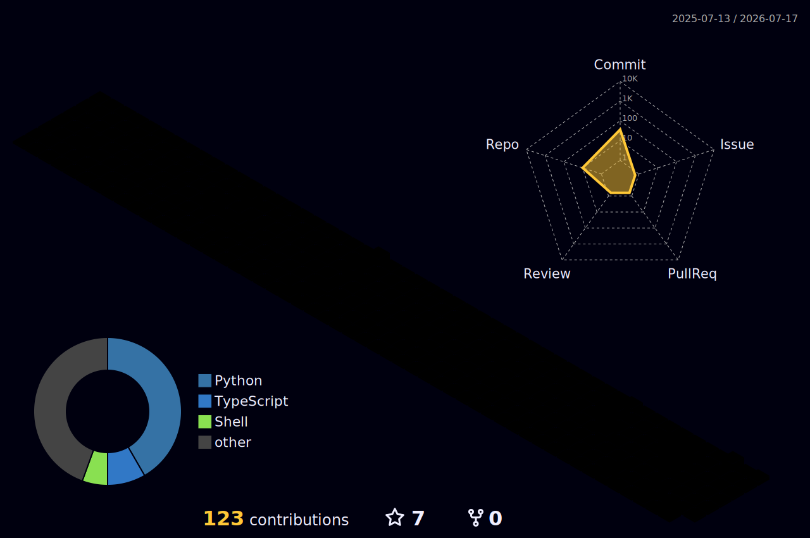

<div align="center">


[](https://github.com/net1nfect)


</div>

```console
root@void:~# ./identify --target net1nfect

  ALIAS       : NET1NFECT
  ENTITY      : GHOST IN THE STACK
  SPECIALITY  : OFFENSIVE SECURITY / CTF / AUTOMATION
  LOCATION    : [REDACTED]
  TRACE       : LOST

root@void:~# ./scan --deep
  [████████████████████████████████] 100%
  WARNING: THE TARGET IS NOW AWARE OF YOUR PRESENCE.
```

<div align="center">

## `// BLACK_BOX`

<sub>Recovered fragments. Open at your own risk.</sub>

</div>

<table>
<tr>
<td width="50%" valign="top">

### `01 // BREACH_LAB`

- [`windows-exploit`](https://github.com/net1nfect/windows-exploit) — Windows attack-surface research
- [`payload-all`](https://github.com/net1nfect/payload-all) — payload archive and experiments
- [`macrovba`](https://github.com/net1nfect/macrovba) — VBA and macro research

</td>
<td width="50%" valign="top">

### `02 // SIGNAL_HUNT`

- [`ctf`](https://github.com/net1nfect/ctf) — captured flags, notes, and writeups
- [`dorking`](https://github.com/net1nfect/dorking) — targeted search automation
- [`rumble-automation`](https://github.com/net1nfect/rumble-automation) — automated recon workflows

</td>
</tr>
</table>

<div align="center">

## `// VOID_ARSENAL`


## `// LIVE_INTRUSION_MAP`


## `// 3D_CONTRIBUTION_MATRIX`



<br>


<sub>AUTHORIZED RESEARCH ONLY // NO SIGNAL IS EVER TRULY LOST</sub>

</div>
